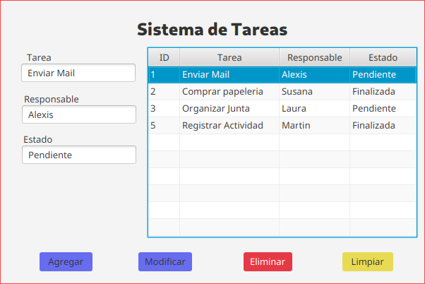

# Tareas – Sistema de Gestión de Tareas

Ejercicio CRUD para la gestión de tareas, desarrollado con una arquitectura basada en MVC, organizada en las siguientes capas:
- Vista: Implementada con JavaFX.
- Servicio: Gestionado con Spring.
- Repositorio: Implementado con Spring Data JPA.
- Entidad: Modelada con Spring Data JPA.
- Base de datos: MySQL para la persistencia de datos.

Se utilizó Maven como gestor de dependencias, incorporando Spring Data JPA, MySQL Driver y Lombok, lo que permitió un desarrollo más ágil y un código más limpio y mantenible.

Interfaz gráfica del sistema:

